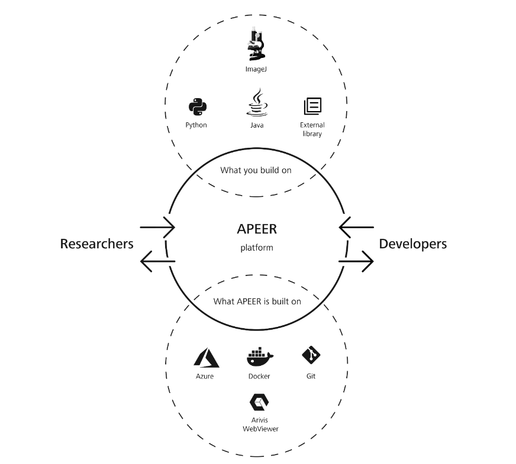
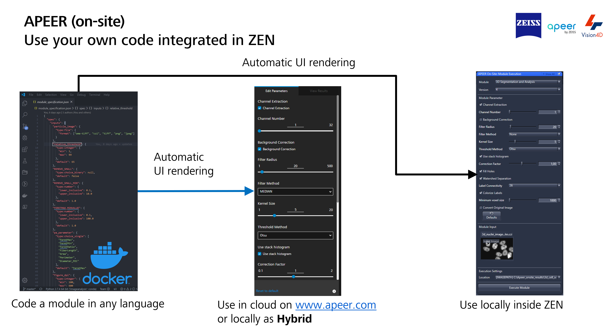

- [General Remarks](#general-remarks)
  - [Prerequisites](#prerequisites)
  - [Content](#content)
  - [Read, process and write CZIs using pylibCZIrw](#read-process-and-write-czis-using-pylibczirw)
  - [Create a simple arivis Cloud Module](#create-a-simple-arivis-cloud-module)
  - [Train a Deep-Learning Model on arivis Cloud](#train-a-deep-learning-model-on-arivis-cloud)
    - [Use the model in your python code](#use-the-model-in-your-python-code)
  - [Train your own models in Python and store as \*.czann](#train-your-own-models-in-python-and-store-as-czann)
  - [Train your own model and package it a using the czmodel package](#train-your-own-model-and-package-it-a-using-the-czmodel-package)
    - [Train a simple model for regression](#train-a-simple-model-for-regression)
  - [Use the model inside Napari (optional)](#use-the-model-inside-napari-optional)
  - [Using the czitools package (experimental)](#using-the-czitools-package-experimental)
    - [Demo Notebooks using czitools](#demo-notebooks-using-czitools)
      - [Read CZI metadata](#read-czi-metadata)
      - [Read CZI pixeldata](#read-czi-pixeldata)
      - [Write OME-ZARR from 5D CZI image data](#write-ome-zarr-from-5d-czi-image-data)
      - [Write CZI using ZSTD compression](#write-czi-using-zstd-compression)
      - [Show planetable of a CZI image as surface](#show-planetable-of-a-czi-image-as-surface)
      - [Read a CZI and segment using Voroni-Otsu provided by PyClesperanto GPU processing](#read-a-czi-and-segment-using-voroni-otsu-provided-by-pyclesperanto-gpu-processing)
  - [Control ZEN via TCP-IP](#control-zen-via-tcp-ip)
- [Disclaimer](#disclaimer)

# General Remarks

This repository contains all the material for the workshop held during the ZEN & Python & OAD Workshop.

***

## Prerequisites

To run the notebooks locally it is recommended to create a fresh conda environment. Please feel to use the provided [YML file](workshop/notebooks/zen_python.yml) (at your own risk) to create such an environment:

    conda env create --file zen_python.yml

> Important: If one wants to test the labeling & training directly on [arivis Cloud] or create a module it is required to have an account.

## Content

The workshop is focusing on various tools and python packages published be ZEISS for reading CZI images, exchanging Deep-Learning models and general image processing The following topics will be covered:

- Read, process and write CZIs using [pylibCZIrw] and [cztile]
- Create a simple [arivis Cloud] Module
- Train a Deep-Learning Model in [arivis Cloud]
- Use the model in your python code
- Use the model inside [Napari]
- Train your own model and package it a using the [czmodel] package
- Using [czitools] package (experimental)
- Control ZEN via TCP-IP (experimental)

## Read, process and write CZIs using pylibCZIrw

This package provides a simple and easy-to-use Python wrapper for [libCZI] - a cross-platform C++ library to read and write multi-dimensional CZI image documents.

- At the moment, **pylibCZIrw** completely abstracts away the subblock concept, both in the reading and in the writing APIs.
- If pylibCZIrw is extended in the future to support subblock-based access (e.g. accessing acquisition tiles), this API must not be altered.
- The core concept of pylibCZIrw is focussing on reading and writing 2D image planes by specifying the dimension indices and its location in order to only read or write **what is really needed**.

The basic usage can be inferred from this sample notebook:&nbsp;

For more detailed information refer to the pylibCZIrw-documentation.html shipped with the source distribution of this package (see the **Download files** section).

## Create a simple arivis Cloud Module

the [arivis Cloud] platform does not allow to train deep learning models but also has tools to create so-called arivis Cloud modules and even workflows built upon a container infrastructure.

In short - arivis Cloud modules are Docker containers with a UI specification that allows using them in the cloud and inside the ZEN software platform. For details please visit: [arivis Cloud - Architecture and Modules](https://docs.apeer.com/create-modules/the-apeer-architecture)

A simple example module based on python can be found here: [arivis Cloud - Simple Python Module](./workshop/apeer_module_example/README.md)

Please follow the instruction on how to create an [arivis Cloud] module using the built-in documentation and copy this code into your own module repository.

## Train a Deep-Learning Model on arivis Cloud

The general idea is to learn how to label a dataset on [arivis Cloud] which will be shared among the participants.

Dataset Name: **cyto2022_nuclei**

- label some nuclei "precisely"
- label background areas and edges
- embrace the idea of partial labeling

- start a training to get a trained model as a *.czann file

Remark: To save time the modelfile: **cyto2022_nuc.czann** will be provided

For more detailed information please visit: [Docs - Partial Annotations](https://docs.apeer.com/machine-learning/annotation-guidelines)

### Use the model in your python code

Once the model is trained it can be downloaded directly to your hard disk and used to segment images.

## Train your own models in Python and store as *.czann

## Train your own model and package it a using the czmodel package

The package provides simple-to-use conversion tools to generate a CZANN file from a [PyTorch], 
[TensorFlow] or [ONNX] model that resides in memory or on disk to be usable in the
ZEN, arivis Cloud, arivisPro software platforms and also in your own code. For details and more information examples please go to: [czmodel]

### Train a simple model for regression

***

## Use the model inside Napari (optional)

In order to use such a model one needs a running python environment with [Napari] and the napari-czann-segment plugin installed.

It can install it via [pip]:

    pip install napari-czann-segment

For more detailed information about the plugin please go to: [Napari Hub - napari-czann-segment](https://www.napari-hub.org/plugins/napari-czann-segment)

***

## Using the czitools package (experimental)

For details please visit: [czitools]

### Demo Notebooks using [czitools]

#### Read CZI metadata

#### Read CZI pixeldata

#### Write OME-ZARR from 5D CZI image data

#### Write CZI using ZSTD compression

#### Show planetable of a CZI image as surface

#### Read a CZI and segment using Voroni-Otsu provided by PyClesperanto GPU processing

## Control ZEN via TCP-IP

For details please check: [ZEN - TCP-IP Interface](https://github.com/zeiss-microscopy/OAD/tree/master/Interfaces/TCP-IP_interface)

# Disclaimer

This content of this repository is free to use for everybody. Carl Zeiss Microscopy GmbH's ZEN software undertakes no warranty concerning the use of those scripts, image analysis settings and ZEN experiments. Use them on your own risk.

**By using any of those examples you agree to this disclaimer.**

Version: 2023.09.22

Copyright (c) 2023 Carl Zeiss AG, Germany. All Rights Reserved.

[Napari]: https://github.com/napari/napari
[pip]: https://pypi.org/project/pip/
[PyPI]: https://pypi.org/
[pylibCZIrw]: https://pypi.org/project/pylibCZIrw/
[czmodel]: https://pypi.org/project/czmodel/
[cztile]: https://pypi.org/project/cztile/
[arivis Cloud]: https://www.apeer.com
[napari-czann-segment]: https://github.com/sebi06/napari_czann_segment
[CZI]: https://www.zeiss.com/microscopy/int/products/microscope-software/zen/czi.html
[PyTorch]: https://pytorch.org/
[TensorFlow]: https://www.tensorflow.org/
[ONNX]: https://onnx.ai/
[libCZI]: https://github.com/ZEISS/libczi
[CytoData2022]: https://alleninstitute.org/what-we-do/cell-science/events-training/cytodata-symposium-2022/
[czitools]: https://pypi.org/project/czitools/
