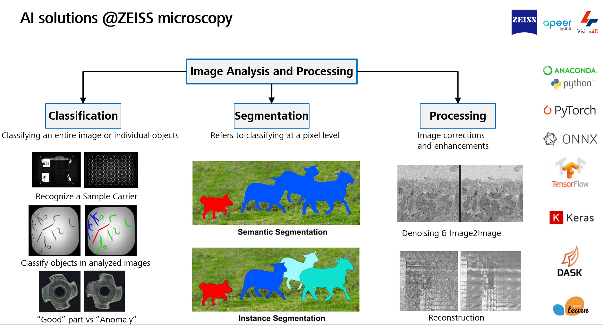
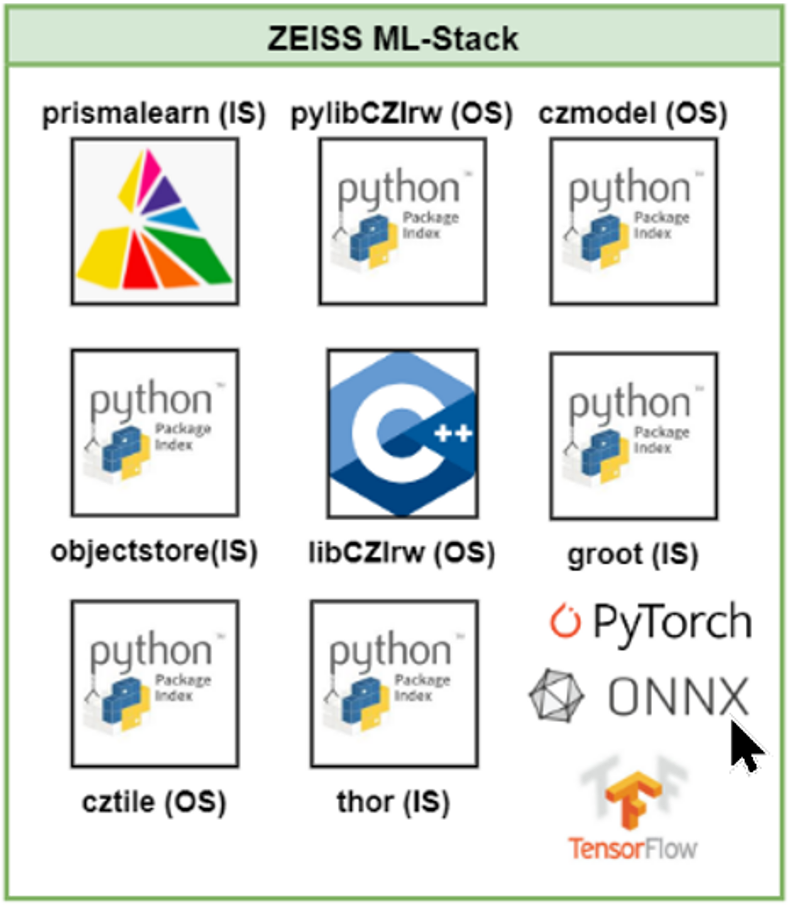
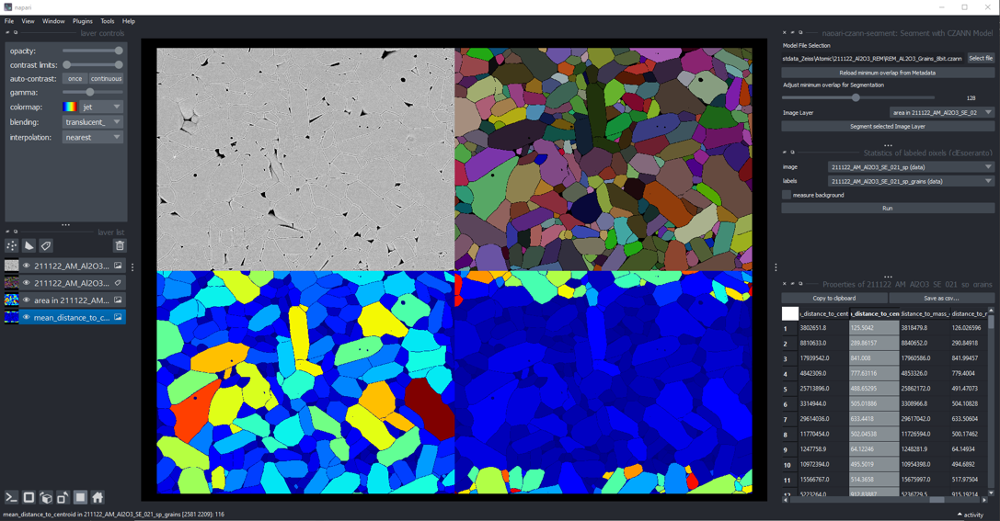

- [General Remarks](#general-remarks)
- [Short Talk](#short-talk)
- [Workshop](#workshop)
  - [Prerequisites](#prerequisites)
  - [Workshop Content](#workshop-content)
  - [Train a Deep-Learning Model in APEER](#train-a-deep-learning-model-in-apeer)
  - [Use the model in your python code or inside Napari](#use-the-model-in-your-python-code-or-inside-napari)
  - [Tile an array to apply a processing function using cztile package](#tile-an-array-to-apply-a-processing-function-using-cztile-package)
  - [Use the model inside Napari (optional)](#use-the-model-inside-napari-optional)
  - [Train your own model and package it a using the czmodel package](#train-your-own-model-and-package-it-a-using-the-czmodel-package)
  - [Read, process and write CZIs using pylibCZIrw](#read-process-and-write-czis-using-pylibczirw)
  - [Create a simple APEER Module](#create-a-simple-apeer-module)
- [Disclaimer](#disclaimer)

# General Remarks

This repository contains all the material for the workshop held during the ZEN & Python & OAD Workshop.

# Short Talk

**Title: ZEISS - Open software ecosystem for data-centric model development**

***

# Workshop

## Prerequisites

All notebooks are supposed to be run in Google Colab in order to not rely on local python environments.

If you prefer or have to run the notebooks locally it is recommended to create a fresh conda environment. Please feel to use the provided [YML file](workshop/notebooks/env_cyto2022.yml) (at your own risk) to create such an environment:

    conda env create --file env_cyto2022.yml

> Important: If one wants to test the labeling & training directly on [APEER] or create a module it is required to have an account.

## Workshop Content

The workshop is focusing on various tools and python packages published be ZEISS for reading CZI images, exchanging Deep-Learning models and general image processing The following topics will be covered:

* Train a Deep-Learning Model in [APEER]
* Use the model in your python code
* Tile an array to apply a deep learning model using [cztile] package
* Use the model inside [Napari]
* Train your own model and package it a using the [czmodel] package
* Read, process and write CZIs using [pylibCZIrw]
* Optional: Create a simple APEER Module

## Train a Deep-Learning Model in APEER

The general idea is to learn how to label a dataset on [APEER] which will be shared among the participants.

Dataset Name: **cyto2022_nuclei**

* label some nuclei "precisely"
* label background areas and edges
* embrace the idea of partial labeling

* start a training to get a trained model as a *.czann file

Remark: To save time the modelfile: **cyto2022_nuc.czann** will be provided

For more detailed information please visit: **[APEER Docs - Partial Annotations](https://docs.apeer.com/machine-learning/annotation-guidelines)**

## Use the model in your python code or inside Napari

Once the model is trained it can be downloaded directly to your hard disk and used to segment images.

Run a prediction using a *.czann file:&nbsp;

***

## Tile an array to apply a processing function using cztile package

In order to apply a model to an image one typically has to tile the array. While there are many ways to achieve this, we @ZEISS mainly use the [cztile] package for that, which is also used inside the [Napari] plugin. The tiling strategy ensures that for a given total area with a minimal number of tiles of constant total area such that:

- the image area is completely covered by tiles and is filled up with as few tiles as possible
- the overlap/border between tiles is as small as possible, but it is ensured that at least a minimum border size is used
- **all interior tiles have the same size**
- a possible excess border is split among tiles and can lead to slightly different tile and border sizes at the edge
- all interior tiles have at least a minimum border width/height on all sides
- the edge tiles have zero border at the edge and at least the minimum border width on their inner sides.
- The sizes of all non-zero borders differ at most by one pixel.

It is not linked directly to the CZI file format, but can be of use to process such images in an efficient and **tile-wise** manner, which is especially important when dealing with larger images.

The basic usage can be inferred from this sample notebook:&nbsp;

## Use the model inside Napari (optional)

In order to use such a model one needs a running python environment with [Napari] and the napari-czann-segment plugin installed.

It can install it via [pip]:

    pip install napari-czann-segment

For more detailed information about the plugin please go to: [Napari Hub - napari-czann-segment](https://www.napari-hub.org/plugins/napari-czann-segment)

***

## Train your own model and package it a using the czmodel package

The package provides simple-to-use conversion tools to generate a CZANN file from a [PyTorch], 
[TensorFlow] or [ONNX] model that resides in memory or on disk to be usable in the
ZEN, APEER, Vison4D software platforms and also in your own code. For details and more information examples please go to: [czmodel]

Train a simple model and package as *.czann file:&nbsp;

***

## Read, process and write CZIs using pylibCZIrw

This package provides a simple and easy-to-use Python wrapper for [libCZI] - a cross-platform C++ library to read and write multi-dimensional CZI image documents.

* At the moment, **pylibCZIrw** completely abstracts away the subblock concept, both in the reading and in the writing APIs.
* If pylibCZIrw is extended in the future to support subblock-based access (e.g. accessing acquisition tiles), this API must not be altered.
* The core concept of pylibCZIrw is focussing on reading and writing 2D image planes by specifying the dimension indices and its location in order to only read or write **what is really needed**.

The basic usage can be inferred from this sample notebook:&nbsp;

For more detailed information refer to the pylibCZIrw-documentation.html shipped with the source distribution of this package (see the **Download files** section).

## Create a simple APEER Module

the [APEER] platform does not allow to train deep learning models but also has tools to create so-called APEER modules and even workflows built upon a container infrastructure.

In short - APEER modules are Docker containers with a UI specification that allows using them on APEER or inside the ZEN software platform. For details please visit: **[APEER Architecture and Modules](https://docs.apeer.com/create-modules/the-apeer-architecture)**

A simple example module based on python can be found here: **[APEER - Simple Python Module](./workshop/apeer_module_example/README.md)**

Please follow the instruction on how to create an [APEER] module using the built-in documentation and copy this code into your own module repository.

***

# Disclaimer

This content of this repository is free to use for everybody. Carl Zeiss Microscopy GmbH's ZEN software undertakes no warranty concerning the use of those scripts, image analysis settings and ZEN experiments. Use them on your own risk.

**By using any of those examples you agree to this disclaimer.**

Version: 2022.10.15

Copyright (c) 2022 Carl Zeiss AG, Germany. All Rights Reserved.

[Napari]: https://github.com/napari/napari
[pip]: https://pypi.org/project/pip/
[PyPI]: https://pypi.org/
[pylibCZIrw]: https://pypi.org/project/pylibCZIrw/
[czmodel]: https://pypi.org/project/czmodel/
[cztile]: https://pypi.org/project/cztile/
[APEER]: https://www.apeer.com
[napari-czann-segment]: https://github.com/sebi06/napari_czann_segment
[CZI]: https://www.zeiss.com/microscopy/int/products/microscope-software/zen/czi.html
[PyTorch]: https://pytorch.org/
[TensorFlow]: https://www.tensorflow.org/
[ONNX]: https://onnx.ai/
[libCZI]: https://github.com/ZEISS/libczi
[CytoData2022]: https://alleninstitute.org/what-we-do/cell-science/events-training/cytodata-symposium-2022/
