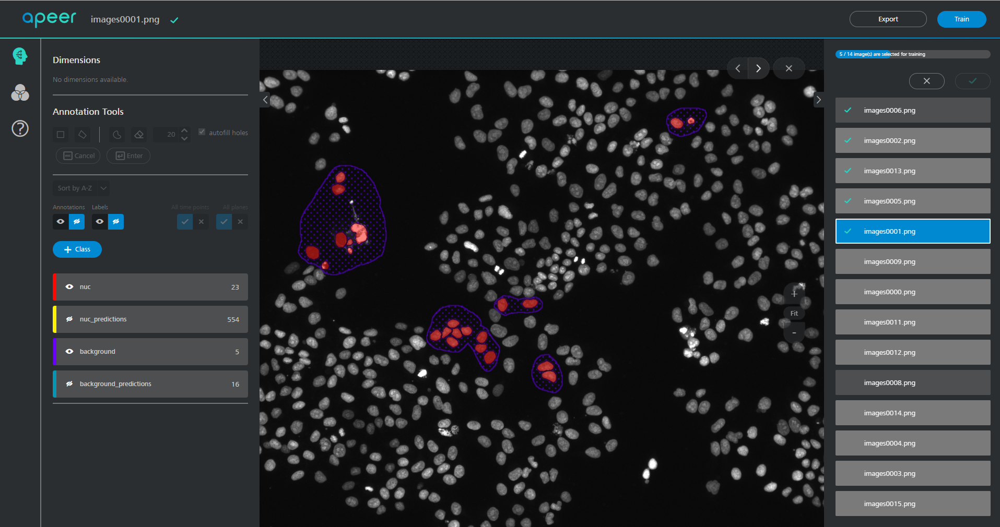
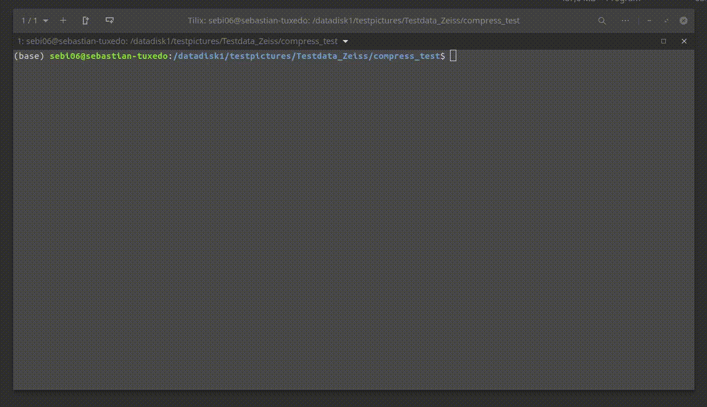
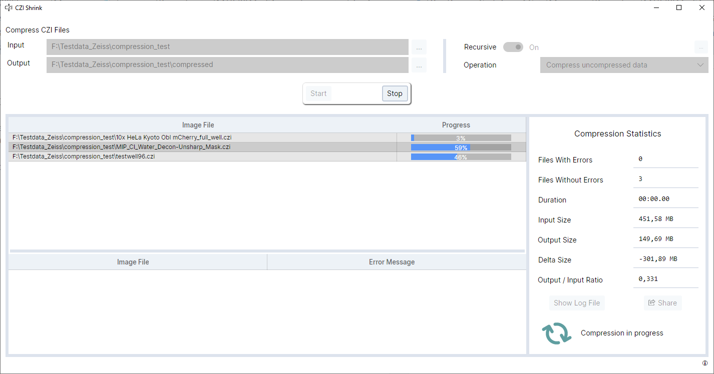
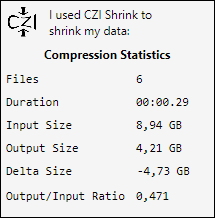
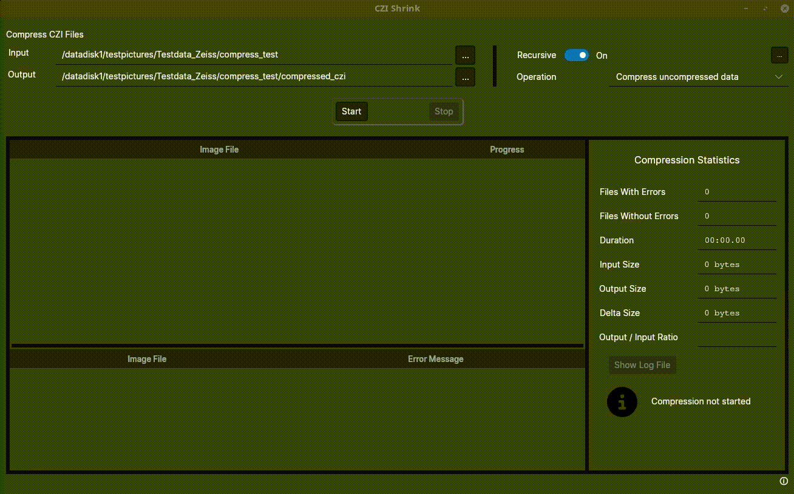
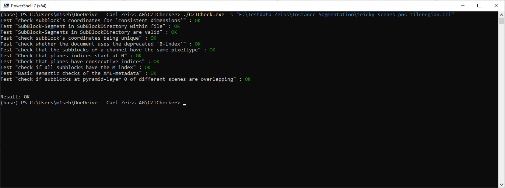
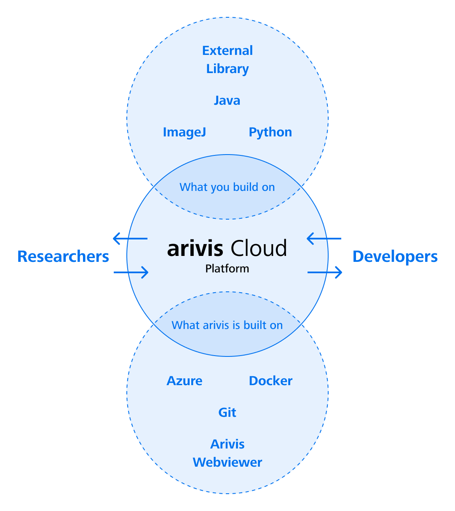
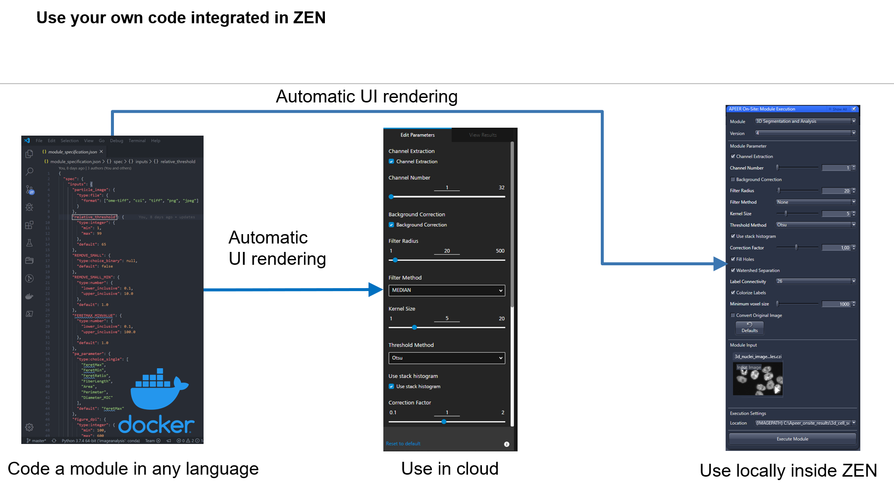

- [Disclaimer](#disclaimer)
- [General Remarks](#general-remarks)
- [Prerequisites](#prerequisites)
- [Content](#content)
  - [Read, process and write CZIs using pylibCZIrw](#read-process-and-write-czis-using-pylibczirw)
  - [Train a Deep-Learning Model on arivis Cloud](#train-a-deep-learning-model-on-arivis-cloud)
    - [Use the model in your python code](#use-the-model-in-your-python-code)
  - [Train your own model and package (as \*.czann) using the czmodel package](#train-your-own-model-and-package-as-czann-using-the-czmodel-package)
    - [Train a simple model for semantic segmentation](#train-a-simple-model-for-semantic-segmentation)
    - [Train a simple model for regression](#train-a-simple-model-for-regression)
  - [Use the model inside Napari (optional)](#use-the-model-inside-napari-optional)
  - [Using the czitools package (experimental)](#using-the-czitools-package-experimental)
    - [Read CZI metadata](#read-czi-metadata)
    - [Read CZI pixeldata](#read-czi-pixeldata)
    - [Write OME-ZARR from 5D CZI image data](#write-ome-zarr-from-5d-czi-image-data)
    - [Write CZI using ZSTD compression](#write-czi-using-zstd-compression)
    - [Show planetable of a CZI image as surface](#show-planetable-of-a-czi-image-as-surface)
    - [Read a CZI and segment using Voroni-Otsu provided by PyClesperanto GPU processing](#read-a-czi-and-segment-using-voroni-otsu-provided-by-pyclesperanto-gpu-processing)
  - [Control ZEN via TCP-IP](#control-zen-via-tcp-ip)
  - [CZICompress](#czicompress)
    - [General usage](#general-usage)
    - [Usage example for single files from commandline (cmd.exe)](#usage-example-for-single-files-from-commandline-cmdexe)
    - [Usage example with multiple files (bash)](#usage-example-with-multiple-files-bash)
  - [CZIShrink](#czishrink)
  - [CZICheck](#czicheck)
  - [Create a simple arivis Cloud Module](#create-a-simple-arivis-cloud-module)

# Disclaimer

This content of this repository is free to use for everybody and purely experimental. Carl Zeiss Microscopy GmbH's ZEN software undertakes no warranty concerning the use of those scripts, image analysis settings and ZEN experiments, especially not for the examples using 3rd python modules. Use them on your own risk.

**By using any of those examples you agree to this disclaimer.**

Version: 2023.09.27

Copyright (c) 2023 Carl Zeiss AG, Germany. All Rights Reserved.

# General Remarks

This repository contains scripts and notebooks showcasing several tools and scripts centered around ZEN, CZI image files, deep-learning models and related python packages.

***

# Prerequisites

To run the notebooks locally it is recommended to create a fresh conda environment. Please feel free to use the provided [YML file](workshop/zen_python.yml) (at your own risk) to create such an environment:

    conda env create --file zen_python.yml

> Important: If one wants to test the labeling & training directly on [arivis Cloud] or create a module it is required to have an account.
> 
> To use [Colab] one needs to have a Google account.
>
> To test and run an [arivis Cloud] module locally one needs [Docker Desktop] or an equivalent runtime installed

# Content

The workshop is focusing on various tools and python packages published by ZEISS for reading CZI images, exchanging Deep-Learning models and general image processing tasks. The following topics will be covered:

- Read, process and write CZIs using [pylibCZIrw] and [cztile]
- Train your own model and package it a using the [czmodel] package
- Train a Deep-Learning Model on the  [arivis Cloud] platform
- Use the model in your python code
- Use the model inside [Napari]
- Using [czitools] package
- Control ZEN via TCP-IP from [Napari]
- [CZICompress], [CZIShrink] and [CZIChecker] - tools built around the CZI image format and its APIs
- Create a simple [arivis Cloud] module to use your own code in ZEN

## Read, process and write CZIs using pylibCZIrw

This package provides a simple and easy-to-use Python wrapper for [libCZI] - a cross-platform C++ library to read and write multi-dimensional CZI image documents.

- The core concept of pylibCZIrw is focussing on reading and writing 2D image planes by specifying the dimension indices and its location in order to only read or write **what is really needed**.

The basic usage can be inferred from this sample notebook:&nbsp;

For more detailed information refer to the pylibCZIrw-documentation.html shipped with the source distribution of this package.

## Train a Deep-Learning Model on arivis Cloud

The general idea is to learn how to label a dataset on [arivis Cloud].

Dataset Name: **cyto2022_nuclei**

- label some nuclei "precisely"
- label background areas and edges
- embrace the idea of partial labeling

- start a training to get a trained model as a *.czann file

Remark: The the modelfile: **cyto2022_nuc.czann** can be found inside the repository.

For more detailed information please visit: [Docs - Partial Annotations](https://docs.apeer.com/machine-learning/annotation-guidelines)

### Use the model in your python code

Once the model is trained it can be downloaded directly to your hard disk and used to segment images in ZEN or arivis Pro or your own python code.

## Train your own model and package (as *.czann) using the [czmodel] package

The package provides simple-to-use conversion tools to generate a CZANN file from a [PyTorch], [TensorFlow] or [ONNX] model that resides in memory or on disk to be usable in the ZEN, arivis Cloud, arivisPro software platforms and also in your own code.

For details and more information examples please go to: [czmodel]

### Train a simple model for semantic segmentation

### Train a simple model for regression

***

## Use the model inside Napari (optional)

In order to use such a model one needs a running python environment with [Napari] and the napari-czann-segment plugin installed.

It can install it via [pip]:

    pip install napari-czann-segment

For more detailed information about the plugin please go to: [Napari Hub - napari-czann-segment](https://www.napari-hub.org/plugins/napari-czann-segment)

***

## Using the [czitools] package (experimental)

For details please visit: [czitools]

### Read CZI metadata

### Read CZI pixeldata

### Write OME-ZARR from 5D CZI image data

### Write CZI using ZSTD compression

### Show planetable of a CZI image as surface

### Read a CZI and segment using Voroni-Otsu provided by PyClesperanto GPU processing

## Control ZEN via TCP-IP

For details please check: [ZEN - TCP-IP Interface](https://github.com/zeiss-microscopy/OAD/tree/master/Interfaces/TCP-IP_interface)

THis repo contains an example on how to control ZEN from Napari. It allows to start an experiment and remotely and open the CZI inside the Napari viewer

Please check the respective code: [napari_zen_connect.py](./workshop/napari_zen_connect/napari_zen_connect.py)

> Important: This requires that one has a real or simulated microscope controlled by ZEN that can actually execute the experiment

## CZICompress

Starting with ZEN 3.9 ZSTD (Z-Standard) will be the new default compression method in ZEN (it was already available longer), but obviously there are already many existing CZI image files "out there" and how to deal with existing ZEN installations that can read uncompressed CZIs but not compressed CZIs?

Therefore we created a command line tool:

- compress or decompress a single CZI file
- versatile
- scriptable
- run in headless/server environments
- run in cron jobs
- cross-platform (focus on linux-x64 and win-x64)
- developed private repo [CZICompress], but will be public very soon

### General usage

Start the executable from the command line, providing the required command line arguments.

    Usage: czicompress [OPTIONS]

    Options:
    -h,--help         Print this help message and exit

    -c,--command COMMAND
                        Specifies the mode of operation: 'compress' to convert to a
                        zstd-compressed CZI, 'decompress' to convert to a CZI
                        containing only uncompressed data.

    -i,--input SOURCE_FILE
                        The source CZI-file to be processed.

    -o,--output DESTINATION_FILE
                        The destination CZI-file to be written.

    -s,--strategy STRATEGY
                        Choose which subblocks of the source file are compressed.
                        STRATEGY can be one of 'all', 'uncompressed',
                        'uncompressed_and_zstd'. The default is 'uncompressed'.

    -t,--compression_options COMPRESSION_OPTIONS
                        Specify compression parameters. The default is
                        'zstd1:ExplicitLevel=0;PreProcess=HiLoByteUnpack'.

    Copies the content of a CZI-file into another CZI-file changing the compression
    of the image data.
    With the 'compress' command, uncompressed image data is converted to
    Zstd-compressed image data. This can reduce the file size substantially. With
    the 'decompress' command, compressed image data is converted to uncompressed
    data.
    For the 'compress' command, a compression strategy can be specified with the
    '--strategy' option. It controls which subblocks of the source file will be
    compressed. The source document may already contain compressed data (possibly
    with a lossy compression scheme). In this case it is undesirable to compress the
    data with lossless zstd, as that will almost certainly increase the file size.
    Therefore, the "uncompressed" strategy compresses only uncompressed subblocks.
    The "uncompressed_and_zstd" strategy compresses the subblocks that are
    uncompressed OR compressed with Zstd, and the "all" strategy compresses all
    subblocks, regardless of their current compression status. Some compression
    schemes that can occur in a CZI-file cannot be decompressed by this tool. Data
    compressed with such a scheme will be copied verbatim to the destination file,
    regardless of the command and strategy chosen.

### Usage example for single files from commandline (cmd.exe)

    SET PATH=$PATH;C:\Users\y1mrn\Downloads\czicompress
    cd /D D:\TestData

    czicompress --command compress -i LLS-31Timepoints-2Channels.czi -o compressed.czi

### Usage example with multiple files (bash)

    export PATH=$PATH:/c/Users/y1mrn/Downloads/czicompress
    cd /d/TestData

    find -type f -name '*.czi' -not -iname '*zstd*' -exec czicompress.sh '{}' \;

## CZIShrink

- Cross Platform GUI App
- Developed, tested and released on Win-x64 and Linux-x64
- Designed to work with large CZI collections (M-Drive)
- Multi-threaded processing
- Strictly non-destructive
- Developed as a private repo on GitHub => release as OSS planned (GPL 3.0)

## CZICheck

CZICheck is a command-line application developed using libCZI, enabling users to assess the integrity and structural correctness of a CZI document.

Checking the validity of a CZI becomes more complex the closer one is to the application domain (e.g. application-specific metadata).
So this console application is more of a utility to help users who are directly using libCZI, or its python wrapper [pylibCZIrw], than it is an official validation tool for any ZEISS-produced CZIs.

CZICheck runs a collection of *checkers* which evaluate a well defined rule.
Each *checker* reports back findings of type Fatal, Warn, or Info.

Please check the tool's internal help by running `CZICheck.exe --help` and check additional documentation on the repository.

## Create a simple arivis Cloud Module

The [arivis Cloud] platform does not allow to train deep learning models but also has tools to create so-called arivis Cloud modules and even workflows built upon a container infrastructure.

In short - arivis Cloud modules are Docker containers with a UI specification that allows using them in the cloud and inside the ZEN software platform. For details please visit: [arivis Cloud - Architecture and Modules](https://docs.apeer.com/create-modules/the-apeer-architecture)

A simple example module based on python can be found here: [arivis Cloud - Simple Python Module](./workshop/apeer_module_example/README.md)

Please follow the instruction on how to create an [arivis Cloud] module using the built-in documentation and copy this code into your own module repository.

[Napari]: https://github.com/napari/napari
[pip]: https://pypi.org/project/pip/
[PyPi]: https://pypi.org/
[pylibCZIrw]: https://pypi.org/project/pylibCZIrw/
[czmodel]: https://pypi.org/project/czmodel/
[cztile]: https://pypi.org/project/cztile/
[arivis Cloud]: https://www.apeer.com
[napari-czann-segment]: https://github.com/sebi06/napari_czann_segment
[CZI]: https://www.zeiss.com/microscopy/int/products/microscope-software/zen/czi.html
[PyTorch]: https://pytorch.org/
[TensorFlow]: https://www.tensorflow.org/
[ONNX]: https://onnx.ai/
[libCZI]: https://github.com/ZEISS/libczi/
[czitools]: https://pypi.org/project/czitools/
[Colab]: https://colab.research.google.com/
[Docker Desktop]: https://www.docker.com/products/docker-desktop/
[CZICompress]: https://github.com/zeissmicroscopy/czicompress/
[CZIChecker]: https://github.com/ZEISS/czicheck/
